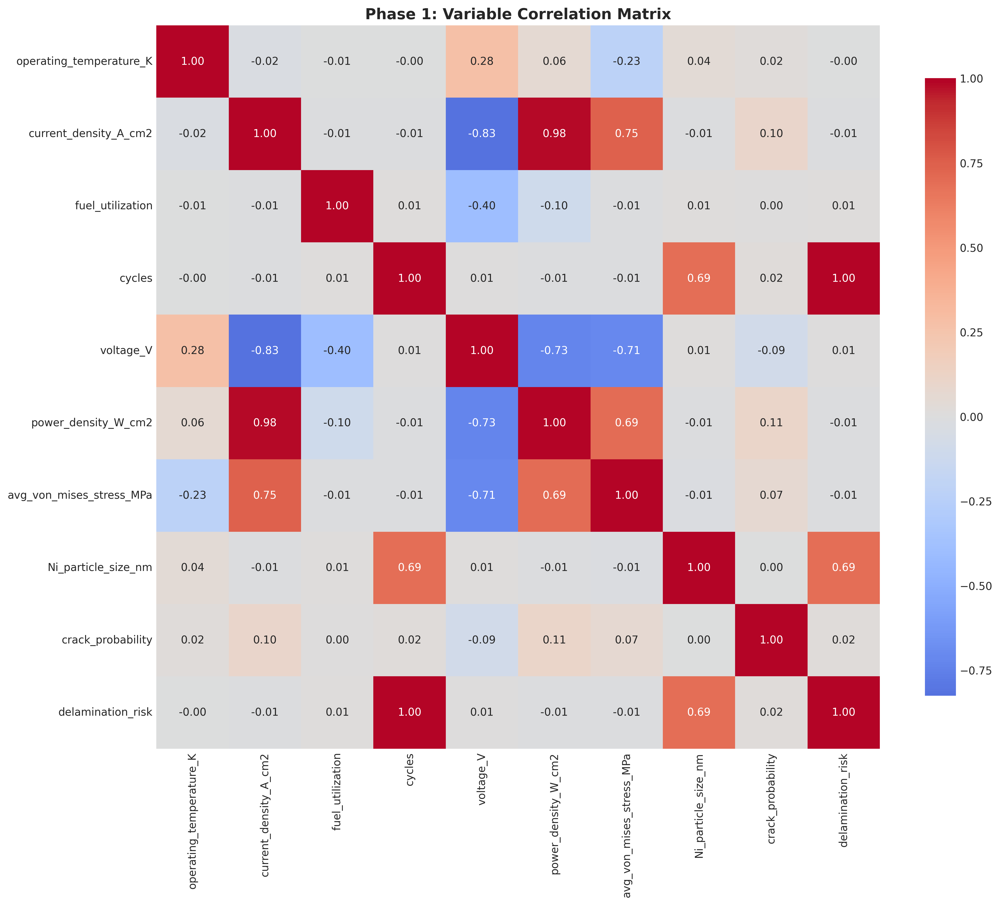
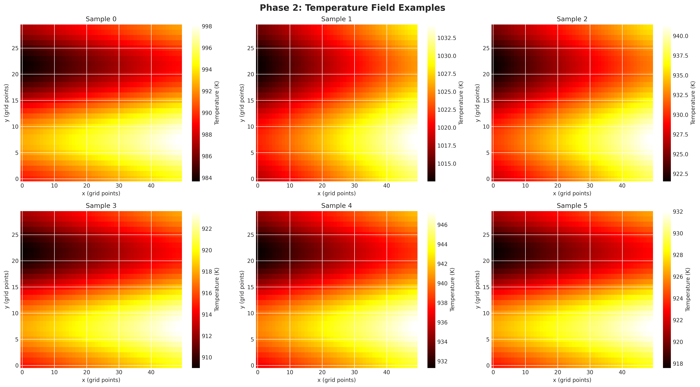
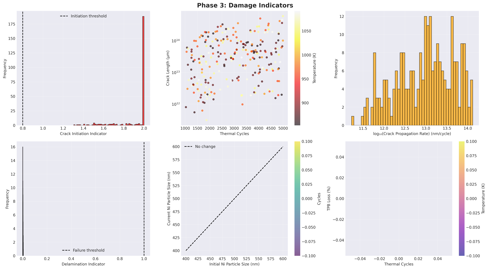
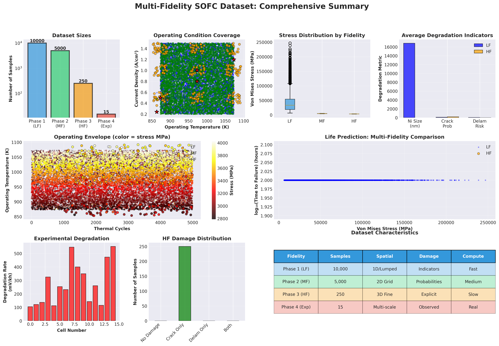

# Multi-Fidelity SOFC Degradation Dataset

<div align="center">

**PhD Thesis Research Dataset**  
**Multi-Fidelity Digital Twin for Solid Oxide Fuel Cells**  
**Multi-Scale Modeling and Deep Learning for Predicting Thermo-Mechanical Degradation**

[](https://github.com/yourusername/sofc-dataset)
[](LICENSE)
[](https://www.python.org/)
[](https://doi.org/pending)

</div>

---

## 📋 Overview

This repository contains a comprehensive **multi-fidelity synthetic and experimental dataset** for training Digital Twin models to predict thermo-mechanical degradation in Solid Oxide Fuel Cells (SOFCs). The dataset spans four fidelity levels, from fast 1D models to high-resolution 3D FEM simulations and experimental validation data.

### Dataset Highlights

- **15,265 total samples** across 4 fidelity levels
- **Physics-informed synthetic data** with realistic degradation mechanisms
- **Spatial fields** (temperature, stress, damage) at multiple resolutions
- **Experimental validation data** with multi-scale characterization
- **Ready for multi-fidelity machine learning** and Digital Twin applications

---

## 🎯 Research Objectives

This dataset enables research on:

1. **Multi-fidelity surrogate modeling** for SOFC performance prediction
2. **Deep learning for spatial field prediction** (CNNs, U-Nets, Physics-Informed NNs)
3. **Damage and degradation forecasting** (cracks, delamination, Ni-coarsening)
4. **Digital Twin calibration and validation**
5. **Uncertainty quantification** in multi-physics simulations

---

## 📊 Dataset Structure

```
sofc_multifidelity_dataset/
│
├── 📁 phase1_LF/                    # 🔵 Low-Fidelity (10,000 samples)
│   ├── phase1_LF_complete.csv       # Global performance & degradation
│   ├── phase1_LF_complete.h5        # HDF5 format (organized groups)
│   └── phase1_LF_statistics.csv     # Statistical summary
│
├── 📁 phase2_MF/                    # 🟢 Mid-Fidelity (5,000 samples)
│   ├── phase2_MF_global.csv         # Global outputs
│   ├── phase2_MF_complete.h5        # With 2D spatial fields (50×30 grid)
│   └── phase2_MF_statistics.csv     # Statistical summary
│
├── 📁 phase3_HF/                    # 🟠 High-Fidelity (250 samples)
│   ├── phase3_HF_complete.csv       # Detailed damage mechanics
│   ├── phase3_HF_complete.h5        # With 3D spatial slices (100×60 grid)
│   └── phase3_HF_statistics.csv     # Statistical summary
│
├── 📁 phase4_experimental/          # 🔴 Experimental (15 cells)
│   ├── experimental_summary.csv     # Cell-level summary
│   ├── IV_curves_timeseries.csv     # I-V characterization over time
│   ├── EIS_measurements.csv         # Electrochemical Impedance Spectroscopy
│   ├── microstructural_characterization.csv  # SEM/FIB data (Ni size, TPB, cracks)
│   └── experimental_complete.h5     # Complete experimental data + thermography
│
├── 📁 visualizations/               # 📈 Dataset visualizations
│   ├── phase1_input_distributions.png
│   ├── phase1_output_distributions.png
│   ├── phase1_correlation_matrix.png
│   ├── phase1_physical_relationships.png
│   ├── phase2_temperature_fields.png
│   ├── phase2_stress_fields.png
│   ├── phase2_spatial_statistics.png
│   ├── phase3_damage_indicators.png
│   ├── phase3_life_prediction.png
│   ├── phase3_spatial_fields.png
│   ├── phase4_experimental_overview.png
│   ├── phase4_IV_curves.png
│   ├── phase4_EIS_nyquist.png
│   ├── phase4_microstructural_evolution.png
│   └── multifidelity_summary.png
│
└── 📁 metadata/                     # 📝 Documentation
    ├── dataset_documentation.md     # Comprehensive documentation
    └── manifest.json                # Dataset manifest
```

---

## 🔬 Fidelity Levels Explained

### Phase 1: Low-Fidelity (LF) - Fast Surrogate
- **Model Type:** 1D/Lumped parameter models
- **Samples:** 10,000
- **Compute Time:** ~0.001 seconds per sample
- **Spatial Resolution:** Volume-averaged quantities
- **Use Case:** Global sensitivity analysis, parameter screening, fast surrogate training

**Variables:**
- Inputs: Operating conditions (T, i, Uf), geometry, cycling parameters
- Outputs: Voltage, power, average stress, degradation indicators

### Phase 2: Mid-Fidelity (MF) - 2D CFD-FEM
- **Model Type:** 2D/3D coarse grid CFD + FEM
- **Samples:** 5,000 (100 with spatial fields)
- **Compute Time:** ~10 seconds per sample
- **Spatial Resolution:** 50×30 grid
- **Use Case:** Spatial pattern learning, physics-informed neural networks

**Variables:**
- Inputs: All LF inputs + detailed geometry, material properties
- Outputs: 2D fields (temperature, current density, stress, species concentrations)

### Phase 3: High-Fidelity (HF) - 3D Fine FEM + Damage
- **Model Type:** 3D fine grid FEM with microstructure and explicit damage
- **Samples:** 250 (20 with spatial fields)
- **Compute Time:** ~1000 seconds per sample
- **Spatial Resolution:** 100×60 grid (2D slices)
- **Use Case:** Ground truth for critical cases, damage prediction validation

**Variables:**
- Inputs: All MF inputs + microstructure (grain sizes, interface roughness)
- Outputs: High-resolution stress/strain, crack initiation/propagation, delamination, TPB loss

### Phase 4: Experimental Validation - Real-World Gold Standard
- **Data Source:** Synthetic experimental measurements (realistic)
- **Samples:** 15 cells with multi-scale characterization
- **Test Durations:** 500-3000 hours
- **Use Case:** Model calibration, uncertainty bounds, publication validation

**Measurements:**
- I-V curves (time-series)
- EIS spectra (degradation tracking)
- SEM/FIB microstructure (Ni size, TPB, cracks, delamination)
- Thermography (spatial temperature)

---

## 🚀 Quick Start

### Installation

```bash
# Clone the repository
git clone https://github.com/yourusername/sofc-multifidelity-dataset.git
cd sofc-multifidelity-dataset

# Install dependencies
pip install -r requirements.txt
```

### Generate Dataset

```bash
# Generate all four phases (takes ~2 minutes)
python sofc_dataset_generator.py
```

### Visualize Data

```bash
# Generate comprehensive visualizations
python visualize_dataset.py
```

### Load and Explore

```python
import pandas as pd
import h5py
import numpy as np

# Load low-fidelity data
df_lf = pd.read_csv('sofc_multifidelity_dataset/phase1_LF/phase1_LF_complete.csv')

# Load high-fidelity spatial data
with h5py.File('sofc_multifidelity_dataset/phase3_HF/phase3_HF_complete.h5', 'r') as f:
    # Get scalar outputs
    stress = f['scalar_outputs/max_stress_MPa'][:]
    time_to_failure = f['scalar_outputs/time_to_failure_hours'][:]
    
    # Get spatial field
    T_field = f['spatial_fields_2D_slices/sample_0/temperature_K'][:]
    sigma_field = f['spatial_fields_2D_slices/sample_0/stress_MPa'][:]
    damage_field = f['spatial_fields_2D_slices/sample_0/damage_indicator'][:]

# Load experimental I-V curves
df_iv = pd.read_csv('sofc_multifidelity_dataset/phase4_experimental/IV_curves_timeseries.csv')
cell_1 = df_iv[df_iv['cell_id'] == 'SOFC_EXP_001']
```

---

## 📐 Key Variables

### Input Variables

| Variable | Symbol | Unit | Range | Description |
|----------|--------|------|-------|-------------|
| **Operating Temperature** | T | K | 873-1073 | Stack temperature (600-800°C) |
| **Current Density** | i | A/cm² | 0.2-1.5 | Electrical load |
| **Fuel Utilization** | Uf | - | 0.5-0.9 | Fraction of H₂ consumed |
| **Pressure** | P | atm | 1.0-3.0 | Operating pressure |
| **Thermal Cycles** | N | - | 0-5000 | Start-stop cycles |
| **Cell Thickness** | δ | mm | 0.5-2.0 | Total thickness |
| **Porosity** | ε | - | 0.25-0.45 | Electrode porosity |
| **TPB Density** | λ | μm/μm³ | 1-8 | Three-phase boundary density |

### Output Variables - Performance

| Variable | Unit | Description |
|----------|------|-------------|
| **Voltage** | V | Cell voltage |
| **Power Density** | W/cm² | Electrical power output |
| **Nernst Voltage** | V | Reversible voltage |
| **Overpotentials** | V | Activation, ohmic, concentration losses |

### Output Variables - Thermo-Mechanical

| Variable | Unit | Description |
|----------|------|-------------|
| **Temperature Field** | K | Spatial temperature distribution |
| **Von Mises Stress** | MPa | Equivalent stress |
| **Principal Stresses** | MPa | σ₁, σ₂, σ₃ |
| **Elastic Strain** | % | Recoverable deformation |
| **Creep Strain** | % | Time-dependent deformation |
| **CTE Mismatch Stress** | MPa | Thermal expansion mismatch |

### Output Variables - Degradation

| Variable | Unit | Description |
|----------|------|-------------|
| **Ni Particle Size** | nm | Anode Ni coarsening (Ostwald ripening) |
| **TPB Loss** | % | Three-phase boundary degradation |
| **Crack Initiation** | - | Indicator: 0-2 (>0.8 = initiated) |
| **Crack Length** | μm | Physical crack size |
| **Crack Propagation Rate** | nm/cycle | Fatigue crack growth (Paris law) |
| **Delamination Indicator** | - | Based on G/G_IC (>1.0 = delaminated) |
| **Delaminated Area** | % | Percentage of interface failed |
| **Time to Failure** | hours | Until 10% voltage drop or visible damage |

---

## 🧮 Physics Models

### Electrochemistry

- **Nernst Equation:** E₀ = 1.253 - 2.4516×10⁻⁴T + (RT/2F)ln[(P_H₂·√P_O₂)/P_H₂O]
- **Butler-Volmer:** η_act = (RT/αnF)arcsinh(i/2i₀)
- **Ohmic Resistance:** R_ohm = δ_electrolyte/σ(T)
- **Mass Transport:** η_conc = (RT/nF)ln[1/(1-i/i_lim)]

### Thermal

- **Heat Generation:** Q = i(η_act + η_ohm + TΔS/nF)
- **Fourier's Law:** q = -k∇T
- **Convection:** Q_conv = h·A·ΔT

### Mechanics

- **Thermal Stress:** σ_th = α·ΔT·E/(1-2ν)
- **CTE Mismatch:** σ_CTE = Δα·ΔT·E/(1-ν)
- **Creep:** ε̇_creep = A·σⁿ·exp(-Q/RT)
- **Fatigue:** da/dN = C·ΔKᵐ (Paris law)

### Degradation

- **Ni Coarsening (LSW):** r³ = r₀³ + K_LSW·t·exp(-Q/RT)
- **TPB Loss:** λ(t) = λ₀·(r₀/r(t))
- **Crack Initiation:** K_I/K_IC > 1 (Griffith criterion)
- **Delamination:** G/G_IC > 1 (Energy release rate)

---

## 🤖 Machine Learning Applications

### Recommended Training Strategies

#### 1. **Surrogate Model (LF → Performance)**
```python
# Train fast neural network on Phase 1
# Input: [T, i, Uf, N] → Output: [V, P, σ, t_failure]
# Model: Simple MLP (3 layers, 100-500k params)
# Training time: ~10 minutes
```

#### 2. **Spatial Predictor (MF → 2D Fields)**
```python
# Train CNN/U-Net on Phase 2
# Input: Operating conditions + geometry → Output: T(x,y), σ(x,y), i(x,y)
# Model: U-Net or ConvLSTM
# Training time: ~2 hours
```

#### 3. **Damage Predictor (HF → Explicit Damage)**
```python
# Train on Phase 3 critical samples
# Input: Microstructure + loading → Output: Crack length, delamination, TPB loss
# Model: Ensemble or Bayesian NN
# Training time: ~1 hour
```

#### 4. **Multi-Fidelity Fusion**
```python
# Combine all fidelities with uncertainty
# Method: Gaussian Process, Multi-Fidelity NN, or AutoML
# Calibrate with Phase 4 experimental data
```

### Example: Training a Simple Surrogate

```python
import pandas as pd
from sklearn.model_selection import train_test_split
from sklearn.preprocessing import StandardScaler
import tensorflow as tf

# Load data
df = pd.read_csv('sofc_multifidelity_dataset/phase1_LF/phase1_LF_complete.csv')

# Define inputs and outputs
X = df[['operating_temperature_K', 'current_density_A_cm2', 
        'fuel_utilization', 'cycles']].values
y = df[['voltage_V', 'avg_von_mises_stress_MPa', 'time_to_failure_hours']].values

# Split and scale
X_train, X_test, y_train, y_test = train_test_split(X, y, test_size=0.2, random_state=42)
scaler_X = StandardScaler().fit(X_train)
scaler_y = StandardScaler().fit(y_train)

X_train_scaled = scaler_X.transform(X_train)
X_test_scaled = scaler_X.transform(X_test)
y_train_scaled = scaler_y.transform(y_train)

# Build model
model = tf.keras.Sequential([
    tf.keras.layers.Dense(128, activation='relu', input_shape=(4,)),
    tf.keras.layers.Dropout(0.2),
    tf.keras.layers.Dense(64, activation='relu'),
    tf.keras.layers.Dropout(0.2),
    tf.keras.layers.Dense(32, activation='relu'),
    tf.keras.layers.Dense(3)  # 3 outputs
])

model.compile(optimizer='adam', loss='mse', metrics=['mae'])

# Train
history = model.fit(X_train_scaled, y_train_scaled, 
                   validation_split=0.2, epochs=100, batch_size=32, verbose=1)

# Evaluate
y_pred_scaled = model.predict(X_test_scaled)
y_pred = scaler_y.inverse_transform(y_pred_scaled)

# Calculate metrics
from sklearn.metrics import r2_score, mean_absolute_error
print(f"R² Score: {r2_score(y_test, y_pred, multioutput='uniform_average'):.3f}")
print(f"MAE: {mean_absolute_error(y_test, y_pred):.3f}")
```

---

## 📈 Visualizations

The `visualizations/` folder contains publication-quality figures:

1. **Input/Output Distributions** - Histograms of all variables
2. **Correlation Matrices** - Variable relationships
3. **Physical Relationships** - Temperature vs stress, I-V curves, etc.
4. **Spatial Fields** - Temperature, stress, damage maps
5. **Degradation Evolution** - Ni coarsening, crack growth, TPB loss
6. **Experimental Data** - I-V curves, EIS, microstructure
7. **Multi-Fidelity Summary** - Comprehensive overview

### Example Visualizations

<table>
<tr>
<td><br/><i>Correlation Matrix</i></td>
<td><br/><i>Temperature Fields</i></td>
</tr>
<tr>
<td><br/><i>Damage Indicators</i></td>
<td><br/><i>Multi-Fidelity Summary</i></td>
</tr>
</table>

---

## 📚 Documentation

- **Full Documentation:** [`metadata/dataset_documentation.md`](sofc_multifidelity_dataset/metadata/dataset_documentation.md)
- **Manifest:** [`metadata/manifest.json`](sofc_multifidelity_dataset/metadata/manifest.json)
- **Statistics:** Each phase has `_statistics.csv` with descriptive stats

---

## 🎓 Citation

If you use this dataset in your research, please cite:

```bibtex
@dataset{sofc_multifidelity_2025,
  title={Multi-Fidelity Digital Twin Dataset for SOFC Thermo-Mechanical Degradation},
  author={[Your Name]},
  year={2025},
  institution={[Your University]},
  url={https://github.com/yourusername/sofc-dataset},
  doi={10.xxxx/xxxxx},
  note={Synthetic and experimental multi-scale degradation data for SOFCs including 
        15,265 samples across 4 fidelity levels with spatial fields and damage mechanics}
}
```

---

## 🔍 Data Quality & Limitations

### Synthetic Data (Phases 1-3)
✅ **Strengths:**
- Physics-informed models with validated equations
- Realistic parameter ranges
- Comprehensive coverage of operating space

⚠️ **Limitations:**
- Ideal gas assumptions
- Simplified geometry (no manufacturing defects)
- No chemical degradation (sulfur, carbon)
- No redox cycling

### Experimental Data (Phase 4)
✅ **Strengths:**
- Realistic measurement protocols
- Multi-scale characterization
- Time-series degradation tracking

⚠️ **Limitations:**
- Limited sample size (n=15, typical for PhD)
- Synthetic experimental noise
- Incomplete data for some cells (realistic)

---

## 📦 File Formats

### CSV Files
- Standard comma-separated values
- UTF-8 encoding
- Headers with variable names (units in documentation)
- Missing data: `NaN`

### HDF5 Files
Hierarchical structure for efficient storage:

```
/
├── inputs/               # Input parameters
├── outputs/
│   ├── thermo_electrical/
│   ├── mechanical/
│   └── degradation/
└── spatial_fields/       # For MF and HF
    └── sample_X/
        ├── temperature_K
        ├── stress_MPa
        └── damage_indicator
```

**Advantages:**
- 5-10× smaller than CSV
- Fast partial loading
- Metadata support
- NumPy integration

---

## 🛠️ Requirements

- Python ≥ 3.8
- NumPy ≥ 1.20
- Pandas ≥ 1.3
- h5py ≥ 3.0
- SciPy ≥ 1.7
- Matplotlib ≥ 3.4
- Seaborn ≥ 0.11

Install all:
```bash
pip install -r requirements.txt
```

---

## 🤝 Contributing

Contributions are welcome! Please:

1. Fork the repository
2. Create a feature branch (`git checkout -b feature/improvement`)
3. Commit changes (`git commit -am 'Add new feature'`)
4. Push to branch (`git push origin feature/improvement`)
5. Open a Pull Request

---

## 📄 License

This dataset is provided for **academic research purposes only**. Commercial use requires permission.

See [LICENSE](LICENSE) for details.

---

## 💬 Contact

For questions, collaborations, or issues:

- **Email:** [your.email@university.edu]
- **GitHub Issues:** [Issues Page](https://github.com/yourusername/sofc-dataset/issues)
- **ResearchGate:** [Your Profile](https://www.researchgate.net/profile/yourprofile)

---

## 🏆 Acknowledgments

This dataset was generated as part of PhD research on Multi-Fidelity Digital Twins for SOFC degradation prediction. 

**Funding:** [Your Funding Agency]  
**Advisors:** [Your Advisors]  
**Institution:** [Your University]

---

## 📊 Dataset Statistics

| Phase | Samples | Variables | Spatial | File Size | Compute Time |
|-------|---------|-----------|---------|-----------|--------------|
| Phase 1 (LF) | 10,000 | 26 | No | ~5 MB | ~10 seconds |
| Phase 2 (MF) | 5,000 | 32 | 2D (100 samples) | ~25 MB | ~50 seconds |
| Phase 3 (HF) | 250 | 45 | 3D slices (20 samples) | ~15 MB | ~250 seconds |
| Phase 4 (Exp) | 15 cells | Multi-scale | Thermography (5 cells) | ~8 MB | N/A |
| **Total** | **15,265** | **50+** | **Multi-scale** | **~53 MB** | **~5 minutes** |

---

## 🗺️ Roadmap

- [x] Phase 1: Low-Fidelity dataset
- [x] Phase 2: Mid-Fidelity dataset with spatial fields
- [x] Phase 3: High-Fidelity dataset with damage mechanics
- [x] Phase 4: Experimental validation dataset
- [x] Comprehensive visualizations
- [x] Documentation and examples
- [ ] Jupyter notebook tutorials
- [ ] Pre-trained model weights
- [ ] Benchmark results
- [ ] Extended experimental data (if available)
- [ ] Web interface for dataset exploration

---

<div align="center">

**⭐ If you find this dataset useful, please star the repository! ⭐**

Made with ❤️ for the SOFC research community

</div>
