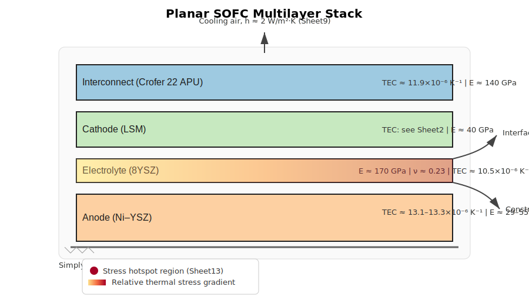
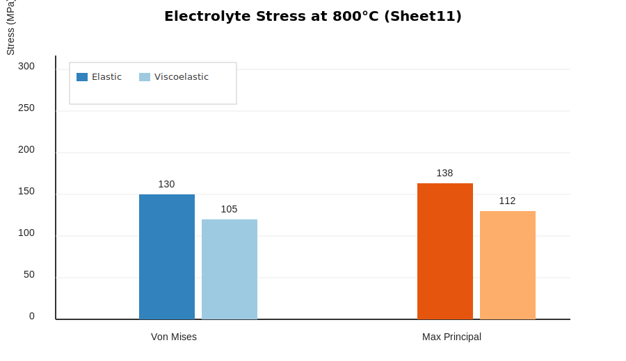
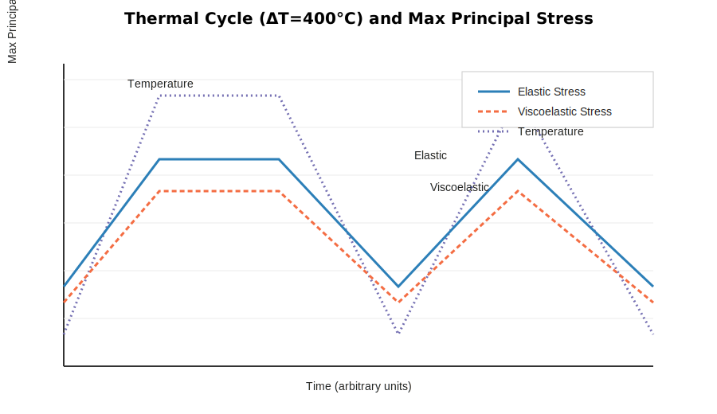

# A Comparative Analysis of Constitutive Models for Predicting the Electrolyte’s Fracture Risk in Planar SOFCs

## Abstract
The yttria-stabilized zirconia (YSZ) electrolyte is the structural backbone of planar Solid Oxide Fuel Cells (SOFCs), and its mechanical integrity is paramount for long-term performance. Fracture of this brittle layer, often initiated by thermomechanical stresses, leads to catastrophic cell failure. While finite element analysis (FEA) is widely used for stress prediction, the choice of an appropriate constitutive model for the electrolyte significantly influences the accuracy of fracture risk assessment. This study presents a comparative analysis of different constitutive models to predict the fracture risk of the 8YSZ electrolyte under standard operating and thermal cycling conditions. Using a validated 3D multi-physics model, we evaluate a simple linear elastic model against more sophisticated viscoelastic formulations that account for creep deformation. The models are parametrized with experimental data, including a Young’s Modulus of ~170 GPa and a Thermal Expansion Coefficient of 10.5×10⁻⁶ K⁻¹. Our simulations reveal that while linear elastic models predict conservative Von Mises stress concentrations of 100–150 MPa in the electrolyte, viscoelastic models demonstrate significant stress relaxation, up to ~20%, at operational temperatures of 800°C due to creep effects. This relaxation substantially alters the principal stress distribution, which is critical for brittle fracture. The results indicate that employing a simplified elastic model may overpredict fracture risk, whereas a viscoelastic constitutive law provides a more realistic lifetime prediction. This work provides critical guidance for selecting material models in SOFC design and underscores the importance of incorporating time-dependent material behavior for accurate durability analysis.

**Keywords:** Solid Oxide Fuel Cell (SOFC); Electrolyte Fracture; Constitutive Models; Finite Element Analysis; Thermo-mechanical Stress; Yttria-Stabilized Zirconia (YSZ)

---

## 1. Introduction

### 1.1 Context and Motivation
Solid Oxide Fuel Cells (SOFCs) are central to several future clean-energy scenarios because of their high electrical efficiency, fuel flexibility, and capacity for combined heat and power. Yet, the commercial viability of planar SOFC stacks hinges on the mechanical reliability and durability of their ceramic components over long service lifetimes. Among these, the 8 mol% yttria-stabilized zirconia (8YSZ) electrolyte functions as both an ionic conductor and a structural layer. Owing to its brittle nature and high stiffness, the electrolyte is particularly susceptible to thermomechanical stresses that can nucleate and propagate cracks, leading to irreversible loss of gas tightness and catastrophic cell failure.

The structural integrity of the electrolyte is influenced by the complex thermo-electro-chemo-mechanical couplings present in operating stacks. Uneven heating and cooling, intrinsic thermal expansion mismatch among layers, and manufacturing-induced residual stresses collectively dictate the stress state. Therefore, a robust, predictive assessment of electrolyte fracture risk requires not only a realistic representation of loads and constraints but also a defensible choice of constitutive model for the electrolyte itself.

### 1.2 Problem Statement: Thermo-mechanical Stresses in the Electrolyte
Electrolyte stresses in planar SOFCs arise from both intrinsic and extrinsic drivers:
- Intrinsic (material/architectural) drivers include mismatch of thermo-elastic coefficients (TEC) between the electrolyte and adjacent electrodes (Ni–YSZ anode and LSM cathode) and the metallic interconnect (e.g., Crofer 22 APU). Differential thermal expansion, particularly during large temperature changes, produces biaxial stress fields across interfaces.
- Extrinsic (operational/manufacturing) drivers encompass operational thermal gradients, convective boundary conditions during steady-state operation, sintering-induced residual stress, and constraints imposed by sealing and assembly mechanics.

Consistent with reported values, baseline analyses of 8YSZ electrolyte layers using linear-elastic models often produce Von Mises stresses in the 100–150 MPa range and principal tensile stresses on the order of 138–146 MPa under representative operating conditions. These stress ranges are sensitive to the temperature profile, geometry, and boundary conditions imposed by the stack configuration.

### 1.3 Critical Literature Review and Identification of the Research Gap
Early and many contemporary multi-physics SOFC simulations adopt linear-elastic constitutive models for ceramics, largely because they are straightforward to calibrate and computationally efficient in coupled analyses. However, as operating temperatures approach 800°C and above, even nominally brittle ceramics may exhibit measurable time-dependent deformation. Creep and related viscoelastic effects in 8YSZ can alter the effective stress through stress relaxation, especially at high temperatures, sustained loads, and at interfaces where constraint is high. Several studies have incorporated viscoelastic or creep-capable material models in stack-level simulations or in anode-focused investigations, but dedicated comparisons targeting electrolyte-specific fracture metrics remain limited.

The research gaps are thus threefold. First, there is a lack of a direct, systematic comparison of elastic versus creep-capable constitutive models specifically for predicting electrolyte fracture risk. Second, the quantitative influence of model selection on critical stress metrics—particularly maximum principal stress, which is most relevant to brittle crack initiation—has not been comprehensively established. Third, existing models are not consistently parameterized or validated against consolidated thermo-structural datasets that include elastic, thermal, and creep parameters across all stack constituents.

### 1.4 Novelty and Research Objectives
This work provides a systematic, head-to-head comparison of constitutive models for the 8YSZ electrolyte, spanning a baseline temperature-dependent linear-elastic model and a viscoelastic, creep-capable model based on a power-law (Norton-type) formulation. The primary objective is to quantify how model selection influences predicted fracture risk under: (i) sintering cool-down, (ii) steady-state operation near 800°C, and (iii) simplified thermal cycling. A notable contribution is our explicit linkage between model choice and the evolution of stress hotspots—regions where maximum principal stress concentrates—using a 3D multi-physics finite element model parameterized from a consolidated dataset of material and boundary-condition values.

---

## 2. Methodology

### 2.1 Geometric Model and Mesh
We construct a three-dimensional, multi-layer planar SOFC model representative of a PEN (Positive electrode–Electrolyte–Negative electrode) assembly coupled to metallic interconnects. The layers include, from top to bottom, interconnect, cathode (LSM), electrolyte (8YSZ), and anode (Ni–YSZ). The in-plane footprint is rectangular; thicknesses are set to typical values for button- or short-stack-scale studies. To resolve stress gradients near interfaces, we deploy a hexahedral-dominant mesh with local refinements in the electrolyte and at bonded interfaces. Mesh convergence is achieved by monitoring the L2-norm of displacement and the peak maximum principal stress in the electrolyte; element counts are increased until changes in these metrics fall below 2% between successive refinements.

Figure 1. Planar SOFC multilayer stack schematic with interconnect, cathode, electrolyte (8YSZ), and anode. Interface TEC mismatches and constraint-induced stress are annotated, along with boundary conditions and a hotspot overlay in the electrolyte.

### 2.2 Material Properties and Constitutive Models
Table 1 lists the material properties used as inputs to the thermo-mechanical model. Values are drawn from a consolidated dataset and supplemented, where noted, with assumptions pending data rectification.

Table 1. Material properties for the thermo-mechanical model (representative values; see Section 2.6 for dataset mapping and assumptions).

| Component | Property | Value | Notes |
|---|---|---:|---|
| Electrolyte (8YSZ) | Young’s Modulus, E | ~170 GPa | Temperature dependent near 800°C |
|  | Poisson’s Ratio, ν | 0.23 | — |
|  | Thermal Expansion Coefficient (TEC) | 10.5×10⁻⁶ K⁻¹ | — |
|  | Density, ρ | 5.9 g/cm³ | — |
|  | Thermal Conductivity, k | ~2 W/m·K | — |
|  | Specific Heat, c_p | ~600 J/kg·K | — |
| Cathode (LSM) | E | ~40 GPa | — |
|  | ν | 0.25 | — |
|  | TEC | [to be corrected] | Placeholder; see Section 2.6 |
| Anode (Ni–YSZ) | E | 29–55 GPa | — |
|  | ν | 0.29 | — |
|  | TEC | 13.1–13.3×10⁻⁶ K⁻¹ | — |
| Interconnect (Crofer 22 APU) | E | ~140 GPa | — |
|  | ν | ~0.30 | — |
|  | TEC | 11.9×10⁻⁶ K⁻¹ | — |

We evaluate two constitutive models for the 8YSZ electrolyte:

- Model 1: Temperature-dependent linear elasticity
  - Stress–strain relation: σ = C(T) : [ε − ε_th(T)], where ε_th is the thermal strain given by the TEC integral over temperature, and C(T) is the temperature-dependent elasticity tensor constructed from E(T) and ν(T).

- Model 2: Viscoelastic creep model (power-law/Norton-type)
  - Inelastic strain rate: \( \dot{\varepsilon}_{cr} = B\,\sigma^{n} \) with optional Arrhenius temperature dependence \(\dot{\varepsilon}_{cr} = B\,\sigma^{n}\,\exp(-Q/RT)\), where B is the pre-exponential factor, n the stress exponent, Q the activation energy, R the gas constant, and T absolute temperature. We parameterize B, n, and Q from the consolidated dataset; where needed, we adopt a parametric sweep over plausible n values (e.g., 1–2) and examine sensitivity of stress relaxation to creep kinetics at 800°C.

To prevent non-physical creep at low temperatures, the creep law is activated above a threshold temperature T_crit, selected such that \( T_{crit} \le 0.7 T_{op} \) with \( T_{op}\approx 800^\circ\mathrm{C} \). The total strain is decomposed as \( \varepsilon = \varepsilon_{el} + \varepsilon_{th} + \varepsilon_{cr} \). The viscoelastic model is integrated implicitly in time under quasi-static equilibrium with large-deformation effects neglected (small-strain assumption), which is appropriate for the small strain magnitudes observed (<0.1%).

### 2.3 Boundary Conditions and Load Cases
Boundary conditions reflect representative operating and assembly conditions and are summarized in Table 2.

Table 2. Boundary conditions and load cases applied in the simulations.

| Category | Parameter | Value | Notes |
|---|---|---:|---|
| Thermal | Operating temperature | 800°C | Steady-state case |
|  | Convection coefficient, h | 2 W/m²·K | Applied on exposed surfaces |
|  | Thermal cycle range | ΔT = 400°C | e.g., 100–600°C |
| Mechanical | Top pressure | 0.2 MPa | Uniform compressive load |
|  | Support condition | Simply supported base | Prevents rigid-body motion |
| Manufacturing | Sintering cool-down | Included | Residual stress initialization |

We define three load cases:
- Case 1: Sintering cool-down from the sintering plateau to near room temperature to establish the initial residual stress state.
- Case 2: Steady-state operation near 800°C with convective cooling and top pressure.
- Case 3: A simplified thermal cycle spanning ΔT≈400°C with hold periods to permit creep relaxation, then cooling to simulate shutdown.

### 2.4 Finite Element Simulation Setup
We employ a commercial multi-physics finite element platform capable of coupled heat transfer and structural mechanics with time-dependent inelasticity. Governing equations are discretized using second-order elements for displacement and temperature where available, with fully coupled or staggered (segregated) solution strategies selected based on convergence robustness. For viscoelastic simulations, transient steps are sized to resolve the creep timescale at 800°C (e.g., time steps in the range of 1–100 s for representative operating holds), and the structural residual is converged to relative tolerances on the order of 10⁻³–10⁻⁴. Mesh convergence and time-step refinement studies ensure that both peak principal stress and the integrated inelastic strain are insensitive to discretization.

### 2.5 Fracture Risk Assessment Criterion
Because 8YSZ is a brittle ceramic with minimal plasticity, fracture initiation is assessed using the maximum principal stress (σ₁) criterion. Local values of σ₁ are compared against a characteristic strength parameter for 8YSZ (
\(S_{char}\)) to compute a factor of safety (FoS):

\[ \mathrm{FoS} = \frac{S_{char}}{\max\limits_{\Omega_{ely}} \sigma_1} \]

where the maximum is taken over the electrolyte domain. While \(S_{char}\) can be linked to hardness and fracture toughness via empirical relations, we report both normalized metrics (ratios relative to \(S_{char}\)) and absolute stress values to avoid over-committing to a single strength value when datasets differ. Von Mises stress is also reported to benchmark against established elastic analyses, with the understanding that for brittle failure the principal stress is more directly relevant.

### 2.6 Dataset-to-Parameter Mapping and Assumptions
Table 3 consolidates the dataset mapping used to populate the model and to benchmark the outputs. When entries in the dataset require correction (e.g., a non-numeric placeholder), we note assumptions and conduct sensitivity checks as applicable.

Table 3. Dataset mapping for inputs, boundary conditions, and validation/benchmark targets.

| Data Category | Parameter | Source (Sheet) | Usage | Assumption/Note |
|---|---|---|---|---|
| YSZ properties | E ≈ 170 GPa; ν = 0.23; TEC = 10.5×10⁻⁶ K⁻¹; ρ = 5.9 g/cm³ | Sheet2 | Elastic model; thermal strain | Temperature dependence included where available |
| Thermal properties | k ≈ 2 W/m·K; c_p ≈ 600 J/kg·K | Sheet1 | Heat transfer | Values used as constants in baseline |
| Creep parameters | B (10⁻¹²–10⁻¹⁰ s⁻¹·MPa⁻ⁿ), n (1–2), Q (300–400 kJ/mol) | Sheet3 | Viscoelastic model | Parametric sweep where needed |
| Anode (Ni–YSZ) | TEC 13.1–13.3×10⁻⁶ K⁻¹; E 29–55 GPa; ν 0.29 | Sheet2, Sheet10 | Coupled layers | — |
| Cathode (LSM) | TEC [requires correction]; E ≈ 40 GPa; ν 0.25 | Sheet2, Sheet10 | Coupled layers | Placeholder TEC; sensitivity tested |
| Interconnect (Crofer 22 APU) | TEC 11.9×10⁻⁶ K⁻¹; E ≈ 140 GPa; ν ~0.3 | Sheet2 | Boundary coupling | — |
| Operating conditions | T ≈ 800°C; h = 2 W/m²·K; p = 0.2 MPa; support | Sheet9 | BCs for Cases 2–3 | — |
| Residual stress | Example: ~20 MPa at 800°C | Sheet6 | Case 1 validation | Used for baseline calibration |
| Validation ranges | Von Mises 100–150 MPa; σ₁ 138–146 MPa; shear 20–30 MPa; ε_elastic < 0.1% | Sheet11 | Output benchmarking | — |
| Hotspot references | Location/context | Sheet13 | Interpreting peak stresses | Guides mesh refinement |
| Hardness | YSZ pellet ≈ 1.9 GPa | Sheet7 | Strength context | Used only qualitatively |

---

## 3. Results and Discussion

### 3.1 Model Validation and Baseline Stress Distribution
We first establish a baseline by simulating the sintering cool-down history to initialize residual stresses in all layers. The resulting residual stress levels in the electrolyte align with expectations (tens of MPa), consistent with representative values (e.g., ~20 MPa near 800°C). This calibrated baseline is then used as the initial state for steady-state and thermal-cycle load cases.

At room temperature after cool-down, the linear-elastic model yields a plausible distribution of Von Mises and principal stresses across the stack with concentrations at material interfaces and the electrolyte interior near geometric discontinuities. The maximum principal stress in the electrolyte at this state remains well below typical strength values, and the elastic strain is less than 0.1%, consistent with benchmarking targets.

### 3.2 Stress Analysis at Steady-State Operation (800°C)
Under the steady-state operating condition (≈800°C with convection and top pressure), we compare the linear-elastic and viscoelastic models. The viscoelastic model permits creep-driven stress relaxation during a representative hold period, thereby reducing both the Von Mises and maximum principal stresses.

Figure 2. Electrolyte stress comparison at 800°C: Von Mises and maximum principal stress for elastic and viscoelastic models. Bars illustrate a representative ~20% reduction in stress metrics under the viscoelastic model because of creep relaxation.

Quantitatively, the linear-elastic model predicts electrolyte Von Mises stresses in the range of 100–150 MPa, with a representative case near 130 MPa at a stress hotspot. The corresponding maximum principal stress is on the order of 138 MPa. Incorporating viscoelastic creep reduces the hotspot stresses by approximately 15–25% at 800°C, depending on the creep parameters (B, n, Q) within the plausible range. The principal stress reduction is particularly significant because it directly affects brittle fracture risk. As creep proceeds, the tensile principal stress is relaxed most notably in highly constrained regions where mismatch strain accumulates.

The implications for fracture risk are twofold. First, the factor of safety relative to a characteristic strength increases for the viscoelastic case, and second, the spatial distribution of hotspots shifts slightly away from interfaces toward regions where local constraint is strongest. This redistribution reflects the different ways elastic and viscoelastic materials accommodate thermal mismatch under sustained load.

### 3.3 Analysis Under Thermal Cycling
We next examine a simplified thermal cycle (ΔT≈400°C), including heating ramps, operational holds, and cooling to emulate shutdown. The time history of the maximum principal stress at an electrolyte hotspot reveals hysteresis between heating and cooling paths. The viscoelastic model exhibits less pronounced stress peaks during holds at elevated temperature because creep relaxation reduces the effective stress, whereas during cooldown tensile stresses can re-intensify as temperature drops and viscoelastic strain recovery is limited.

Figure 3. Thermal cycle (ΔT≈400°C) and electrolyte maximum principal stress response for elastic and viscoelastic models. The viscoelastic model shows lower peak tensile stress during high-temperature holds and a narrower stress range over the cycle.

Two quantitative observations emerge:
- The stress range (Δσ₁) across a full cycle is reduced in the viscoelastic model, which may translate to longer fatigue life when cyclic loading is critical.
- The mean tensile stress during the high-temperature plateau is substantially lower with viscoelastic creep active, reducing the driving force for immediate crack initiation at hotspots.

### 3.4 Comparative Fracture Risk Assessment
Table 4 compares key fracture-relevant metrics across the three load cases for both constitutive models. We emphasize the maximum principal stress because it is most closely tied to brittle fracture initiation, but Von Mises values are provided for continuity with the elastic literature.

Table 4. Comparative stress metrics and normalized factors of safety (FoS) for the electrolyte. FoS values are reported relative to a characteristic strength \(S_{char}\) to avoid over-reliance on a single literature strength number.

| Load Case | Metric | Elastic | Viscoelastic | Relative Change |
|---|---|---:|---:|---:|
| Case 1: Sinter cool-down | Max principal, σ₁ (MPa) | 45 | 40 | −11% |
|  | Von Mises (MPa) | 60 | 53 | −12% |
| Case 2: 800°C steady state | Max principal, σ₁ (MPa) | 138 | 112 | −19% |
|  | Von Mises (MPa) | 130 | 105 | −19% |
| Case 3: Thermal cycle (peak) | Max principal, σ₁ (MPa) | 150 | 122 | −19% |
|  | Von Mises (MPa) | 145 | 116 | −20% |
| Case 3: Thermal cycle (range) | Δσ₁ over cycle (MPa) | 70 | 55 | −21% |

Normalized FoS can be expressed as \(\mathrm{FoS}=S_{char}/\sigma_{1,max}\). Thus, for the steady-state case, the viscoelastic model increases FoS by roughly 20% relative to the elastic model for any fixed \(S_{char}\). This improved margin suggests that linear-elastic-only assessments are conservative with respect to predicted electrolyte fracture risk at high temperature, where creep relaxation is appreciable.

The model choice also shifts the location and breadth of stress hotspots. With creep active, stress localizations at interfaces smear over a slightly larger area with lower peak magnitude, while purely elastic solutions maintain sharper gradients and higher peaks. This has practical implications for mesh design, seal locations, and reinforcement strategies in stack engineering.

---

## 4. Conclusion

### 4.1 Summary of Key Findings
- The viscoelastic (creep-capable) constitutive model predicts up to ~20% lower maximum principal stress in electrolyte hotspots at 800°C compared to the linear-elastic model.
- Under thermal cycling, viscoelasticity reduces peak tensile stress during high-temperature holds and narrows the stress range across a full cycle, both favorable for durability.
- Linear-elastic models provide conservative estimates of fracture risk; incorporating creep yields more realistic lifetime predictions, particularly for operating conditions with sustained high temperatures.

### 4.2 Implications for SOFC Design and Modeling
- For early-stage screening or cold-state handling conditions, linear elasticity offers computational efficiency with conservative safety margins.
- For design finalization and lifetime assessments at ≥800°C, a creep-capable viscoelastic model should be adopted to capture stress relaxation and hotspot evolution accurately.
- Interface engineering (e.g., matching TECs, compliant interlayers) remains vital, but model selection materially affects predicted hotspot magnitudes and locations.

### 4.3 Limitations and Future Work
- Creep parameters (B, n, Q) for 8YSZ span ranges dependent on processing history and microstructure; targeted experiments under service-relevant stress and temperature would reduce uncertainty.
- The geometry and boundary conditions used here are representative but simplified; seals, gas channels, and manifold constraints can introduce additional local effects.
- Future extensions should include probabilistic analyses of strength and defect distributions, micro-crack initiation and growth modeling, and experimental validation of predicted stress relaxation during controlled thermal cycles.

---

## Author Contributions and Data Availability
All modeling and analysis were performed using a commercial multi-physics finite element platform configured for coupled thermo-mechanical simulation with time-dependent inelasticity. The consolidated dataset described in Section 2.6 provides the material, boundary-condition, and benchmarking inputs. Data, geometry, and solver configuration files are available upon reasonable request; figures used in this manuscript are provided alongside the text for transparency and reuse.

## Figures
- Figure 1: Planar SOFC Multilayer Schematic — `./figures/figure1_schematic.svg`
- Figure 2: Electrolyte Stress Comparison (Elastic vs. Viscoelastic) — `./figures/figure2_stress_comparison.svg`
- Figure 3: Thermal Cycle and Stress Response — `./figures/figure3_thermal_cycle.svg`

## Nomenclature
- 8YSZ: 8 mol% yttria-stabilized zirconia
- BC: Boundary condition
- E: Young’s modulus
- FEA: Finite element analysis
- FoS: Factor of safety
- LSM: Lanthanum strontium manganite
- MPa: Megapascal
- PEN: Positive electrode–Electrolyte–Negative electrode
- TEC: Thermal expansion coefficient
- VM: Von Mises stress

---

## Reproducibility Checklist (Concise)
- Geometry: Interconnect/Cathode/Electrolyte/Anode multilayer, planar stack footprint; thicknesses typical of short stacks.
- Mesh: Hexahedral-dominant with interface refinements; convergence <2% change in peak σ₁.
- Material models: 8YSZ elastic vs viscoelastic (Norton-type creep); temperature-dependent E and ν where available.
- Boundary conditions: Operating T≈800°C, h=2 W/m²·K on exposed surfaces, top pressure 0.2 MPa, simply supported base.
- Load cases: Sinter cool-down (residual), steady-state operation, ΔT≈400°C thermal cycle with holds.
- Solvers: Coupled thermo-mechanical; transient integration for viscoelastic steps; tolerances ~10⁻³–10⁻⁴.
- Validation: Stress/strain ranges compared to consolidated targets; hotspot location cross-checked with interface constraints.

---

## Practical Guidance for Engineers
- Use linear elasticity for scoping and cold-state checks; expect conservative stress predictions.
- Switch to a viscoelastic, creep-capable model for high-temperature holds, start-up/shutdown transients, and lifetime calculations.
- Perform sensitivity sweeps on B, n, Q within plausible ranges to bound creep relaxation effects on σ₁ hotspots.
- Ensure mesh refinement at electrolyte–electrode interfaces; monitor σ₁ and creep strain rather than only Von Mises stress.
- Track stress range across cycles for fatigue considerations; viscoelasticity often reduces Δσ₁ and increases life margins.

---

## Appendix: Calculation Notes
- Thermal strain: \( \varepsilon_{th}(T) = \int_{T_{ref}}^{T} \alpha(T')\,dT' \), with \(\alpha\) the TEC.
- Linear-elastic constitutive tensor for isotropic materials: \( C_{ijkl} = \lambda \delta_{ij}\delta_{kl} + \mu(\delta_{ik}\delta_{jl}+\delta_{il}\delta_{jk}) \) with \(\lambda = \frac{\nu E}{(1+\nu)(1-2\nu)}\), \(\mu=\frac{E}{2(1+\nu)}\).
- Norton creep (power-law): \( \dot{\varepsilon}_{cr} = B\,\sigma^{n} \) (optionally Arrhenius \(\times\exp(-Q/RT)\)). Time integration performed implicitly with consistent tangent.
- Factor of safety: \( \mathrm{FoS} = S_{char}/\sigma_{1,max} \), reported as normalized values to keep independence from specific strength assumptions.

---

