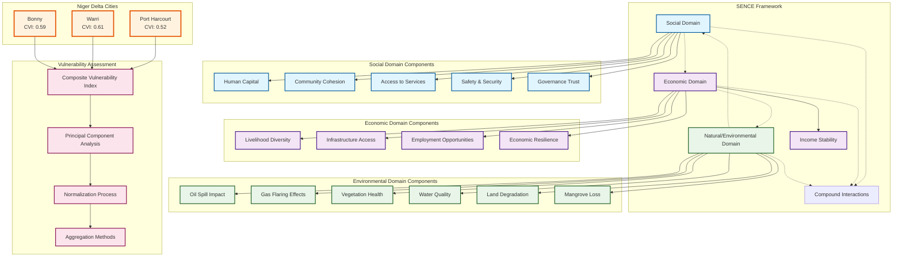
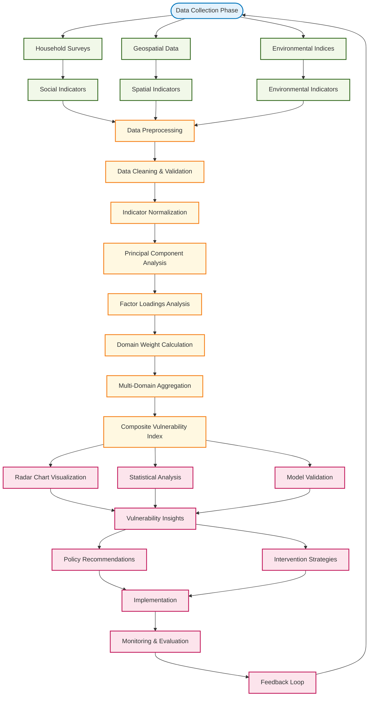
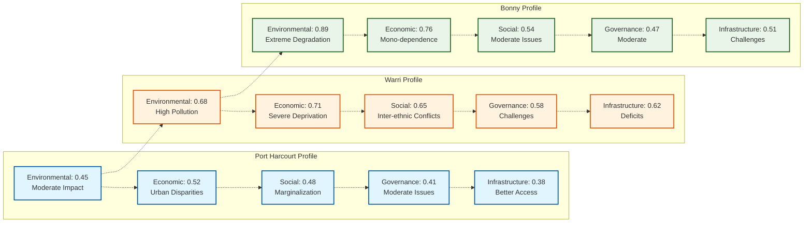
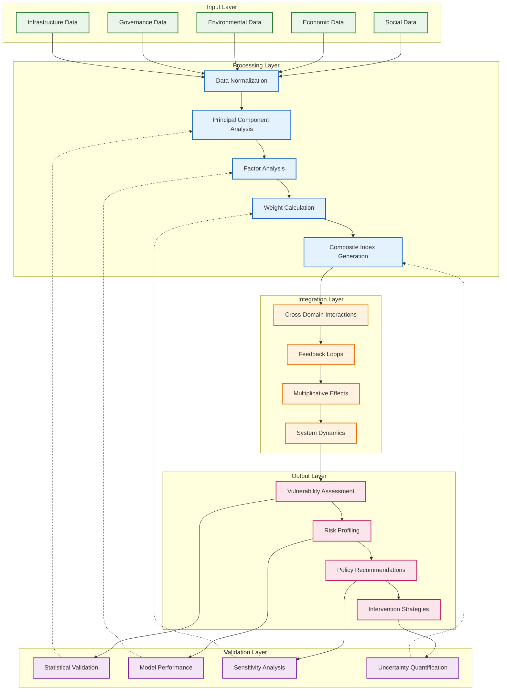

# SENCE Framework Mermaid Diagrams

## 1. SENCE Framework Structure Diagram

## 2. Vulnerability Assessment Workflow

## 3. City-Specific Vulnerability Profiles

## 4. SENCE Framework Integration Model

