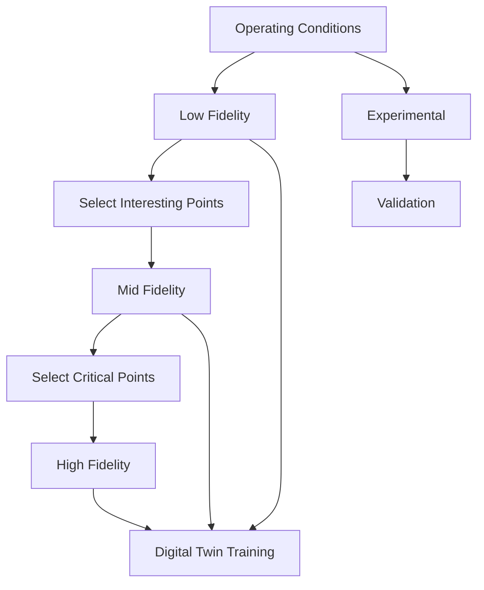

# SOFC Multi-Fidelity Digital Twin Dataset

## PhD Research: Multi-Scale Modeling and Deep Learning for Predicting Thermo-Mechanical Degradation

This repository contains a comprehensive multi-fidelity dataset generator for Solid Oxide Fuel Cell (SOFC) degradation prediction, designed specifically for developing Digital Twin models using deep learning approaches.

### 🎯 Research Objectives

This dataset supports PhD research on:
- **Multi-fidelity machine learning** for SOFC performance prediction
- **Digital twin development** for real-time monitoring and control
- **Thermo-mechanical degradation** modeling across multiple scales
- **Deep learning approaches** for cross-fidelity data fusion

### 📊 Dataset Overview

The framework generates four levels of fidelity:

#### 1. **Low Fidelity (LF)** - 1D Lumped Models
- **Samples**: 50,000+
- **Computation**: ~0.1 sec/sample
- **Features**: Global performance metrics
- **Use Case**: Large-scale parametric studies, initial training

#### 2. **Mid Fidelity (MF)** - 2D FEM Models  
- **Samples**: 5,000
- **Computation**: ~10 sec/sample
- **Features**: 2D spatial fields (50×50 mesh)
- **Use Case**: Spatial pattern recognition, field reconstruction

#### 3. **High Fidelity (HF)** - 3D FEM Models
- **Samples**: 200
- **Computation**: ~600 sec/sample
- **Features**: 3D fields with microstructure (100×100×20 mesh)
- **Use Case**: Detailed physics validation, transfer learning anchors

#### 4. **Experimental** - Simulated Measurements
- **Samples**: 20
- **Features**: IV curves, EIS, thermography, SEM, XRD
- **Use Case**: Real-world validation, uncertainty quantification

### 🔧 Installation

```bash
# Clone repository
git clone <repository_url>
cd sofc_multifidelity_dataset

# Install dependencies
pip install -r requirements.txt
```

### 🚀 Quick Start

#### Generate Small Test Dataset
```bash
# Generate small dataset for testing (1% of full size)
python generate_full_dataset.py --scale 0.01
```

#### Generate Full Dataset
```bash
# Generate complete dataset (WARNING: This will take several hours!)
python generate_full_dataset.py --scale 1.0
```

#### Custom Generation
```python
from generators.low_fidelity import generate_lf_dataset
from generators.mid_fidelity import generate_mf_dataset
from generators.high_fidelity import generate_hf_dataset
from generators.experimental import generate_experimental_dataset

# Generate only low-fidelity data
df_lf, path_lf = generate_lf_dataset(n_samples=1000)

# Generate mid-fidelity using LF for sampling
df_mf, fields_mf, path_mf = generate_mf_dataset(n_samples=100)

# Generate high-fidelity for critical conditions
df_hf, fields_hf, path_hf = generate_hf_dataset(n_samples=10)

# Generate experimental data
df_exp, exp_data, path_exp = generate_experimental_dataset(n_samples=5)
```

### 📁 Dataset Structure

```
data/
├── lf_dataset.h5              # Low-fidelity data
├── lf_dataset.csv              # LF scalar data (for easy inspection)
├── mf_dataset.h5               # Mid-fidelity with 2D fields
├── mf_dataset_scalars.csv      # MF scalar features
├── hf_dataset.h5               # High-fidelity with 3D fields
├── hf_dataset_scalars.csv      # HF scalar features
├── experimental_dataset.h5     # Experimental measurements
├── experimental_dataset_summary.csv
└── generation_log.json         # Generation metadata
```

### 📈 Key Features

#### Input Variables (Operating Conditions)
- **Temperature**: 600-1000°C
- **Pressure**: 1-5 bar
- **Current Density**: 0-1 A/cm²
- **Fuel Utilization**: 40-90%
- **Air Utilization**: 10-30%
- **Time**: 0-50,000 hours
- **Thermal Cycles**: 0-1000 cycles

#### Output Variables

**Thermo-Chemo-Electrical**:
- Temperature fields (1D/2D/3D)
- Current density distributions
- Species concentrations (H₂, H₂O, O₂)
- Overpotentials (activation, ohmic, concentration)

**Mechanical**:
- Stress tensor fields (von Mises, principal)
- Strain fields (elastic, creep)
- Damage indicators (crack density, delamination risk)

**Degradation Metrics**:
- Nickel coarsening fraction
- Chromium poisoning coverage
- Voltage degradation rate (mV/1000h)
- Estimated lifetime (hours)

### 🔬 Physical Models

The dataset incorporates validated physics including:

- **Electrochemistry**: Butler-Volmer kinetics, Nernst equation
- **Thermal**: Heat generation, conduction, convection
- **Species Transport**: Diffusion, consumption, generation
- **Mechanics**: Thermal stress, creep, fatigue
- **Degradation**: Ni coarsening, Cr poisoning, crack propagation
- **Microstructure**: Porosity, tortuosity, TPB density

### 📊 Data Visualization

```python
from visualization.visualize_data import SOFCDataVisualizer

# Create visualizer
viz = SOFCDataVisualizer(data_dir='data')

# Generate comprehensive report
viz.generate_summary_report(output_dir='reports')

# Visualize specific aspects
viz.plot_fidelity_comparison()
viz.plot_degradation_analysis()
viz.visualize_2d_fields('data/mf_dataset.h5', sample_idx=0)
viz.visualize_3d_fields('data/hf_dataset.h5', sample_idx=0, field_name='temperature')
viz.plot_experimental_measurements('data/experimental_dataset.h5', sample_idx=0)
```

### 🤖 Machine Learning Applications

This dataset is designed for:

#### 1. Multi-Fidelity Learning
```python
# Example: Multi-fidelity Gaussian Process
from sklearn.gaussian_process import GaussianProcessRegressor
import h5py

# Load multi-fidelity data
with h5py.File('data/lf_dataset.h5', 'r') as f:
    X_lf = f['data/current_density'][:]
    y_lf = f['data/voltage'][:]

with h5py.File('data/hf_dataset.h5', 'r') as f:
    X_hf = f['scalar_data/current_density'][:]
    y_hf = f['scalar_data/voltage'][:]

# Train multi-fidelity model (simplified example)
gp_lf = GaussianProcessRegressor().fit(X_lf.reshape(-1, 1), y_lf)
# Use LF predictions as features for HF model
```

#### 2. Field Reconstruction
```python
# Example: CNN for 2D field reconstruction
import torch
import torch.nn as nn

class FieldReconstructor(nn.Module):
    def __init__(self):
        super().__init__()
        self.encoder = nn.Sequential(
            nn.Linear(10, 64),  # Operating conditions
            nn.ReLU(),
            nn.Linear(64, 256)
        )
        self.decoder = nn.Sequential(
            nn.ConvTranspose2d(1, 32, 4, 2, 1),
            nn.ReLU(),
            nn.ConvTranspose2d(32, 1, 4, 2, 1),  # 50x50 field
        )
    
    def forward(self, conditions):
        encoded = self.encoder(conditions)
        field = self.decoder(encoded.view(-1, 1, 16, 16))
        return field
```

#### 3. Degradation Prediction
```python
# Example: LSTM for time-series degradation
class DegradationPredictor(nn.Module):
    def __init__(self, input_size=10, hidden_size=64):
        super().__init__()
        self.lstm = nn.LSTM(input_size, hidden_size, num_layers=2)
        self.fc = nn.Linear(hidden_size, 1)  # Predict degradation rate
    
    def forward(self, sequence):
        lstm_out, _ = self.lstm(sequence)
        prediction = self.fc(lstm_out[-1])
        return prediction
```

### 📝 Configuration

Modify `config.yaml` to adjust:
- Material properties
- Geometry specifications
- Operating condition ranges
- Dataset sizes
- Mesh resolutions
- Physical model parameters

### 🔄 Data Pipeline



### 📚 Citation

If you use this dataset in your research, please cite:

```bibtex
@dataset{sofc_multifidelity_2024,
  title={Multi-Fidelity Dataset for SOFC Digital Twin Development},
  author={[Your Name]},
  year={2024},
  institution={[Your University]},
  note={PhD Thesis: Multi-Scale Modeling and Deep Learning for 
        Predicting Thermo-Mechanical Degradation in SOFCs}
}
```

### 🛠️ Advanced Usage

#### Parallel Generation
```python
from multiprocessing import Pool
from generators.low_fidelity import LowFidelitySOFCModel

def generate_sample(conditions):
    model = LowFidelitySOFCModel(config)
    return model.simulate(conditions)

# Parallel execution
with Pool(processes=8) as pool:
    results = pool.map(generate_sample, conditions_list)
```

#### Custom Physics Models
```python
from models.sofc_physics import ElectrochemicalModel

class CustomElectrochemicalModel(ElectrochemicalModel):
    def activation_overpotential(self, i, T, electrode):
        # Implement custom kinetics
        return custom_calculation(i, T)
```

#### Data Augmentation
```python
def augment_field_data(field, noise_level=0.01):
    """Add realistic noise to field data"""
    noise = np.random.normal(0, noise_level * field.std(), field.shape)
    augmented = field + noise
    return augmented
```

### 🐛 Troubleshooting

**Memory Issues**:
```bash
# For large datasets, use chunked reading
with h5py.File('data/hf_dataset.h5', 'r') as f:
    # Read in chunks
    for i in range(0, n_samples, chunk_size):
        chunk = f['field_data_3d'][i:i+chunk_size]
        process_chunk(chunk)
```

**Slow Generation**:
```bash
# Use smaller scale factor for testing
python generate_full_dataset.py --scale 0.001

# Or generate only specific fidelity
python generators/low_fidelity.py
```

### 📊 Dataset Statistics

After full generation (scale=1.0):

| Fidelity | Samples | Features | 2D/3D Fields | Size (GB) | Time |
|----------|---------|----------|--------------|-----------|------|
| Low      | 50,000  | 25       | -            | ~0.1      | 1 min |
| Mid      | 5,000   | 30       | 7 types      | ~2        | 15 min |
| High     | 200     | 35       | 16 types     | ~5        | 2 hours |
| Exp.     | 20      | 15       | 5 techniques | ~0.5      | 5 min |

### 🔮 Future Work

- [ ] GPU acceleration for field computations
- [ ] Real experimental data integration
- [ ] Advanced degradation mechanisms
- [ ] Multi-phase flow modeling
- [ ] Uncertainty quantification
- [ ] Active learning for optimal sampling

### 🤝 Contributing

Contributions are welcome! Please:
1. Fork the repository
2. Create a feature branch
3. Submit a pull request

### 📄 License

This project is licensed under the MIT License - see LICENSE file for details.

### 🙏 Acknowledgments

- SOFC physics models based on literature [Zhu & Kee, 2017]
- Degradation mechanisms from [Hubert et al., 2018]
- Multi-fidelity approaches inspired by [Perdikaris et al., 2017]

### 📧 Contact

For questions or collaborations:
- Email: [your.email@university.edu]
- GitHub Issues: [repository_url/issues]

---

**Happy researching! May your Digital Twin predict degradation accurately! 🚀**